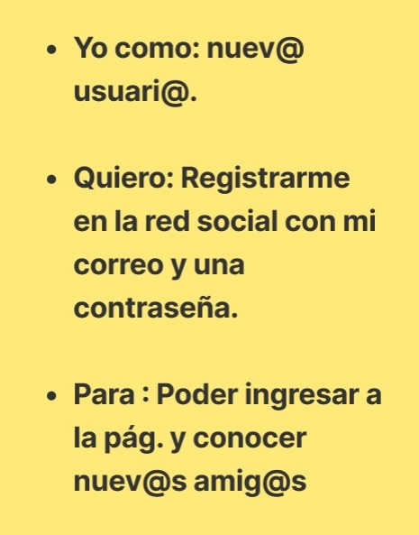
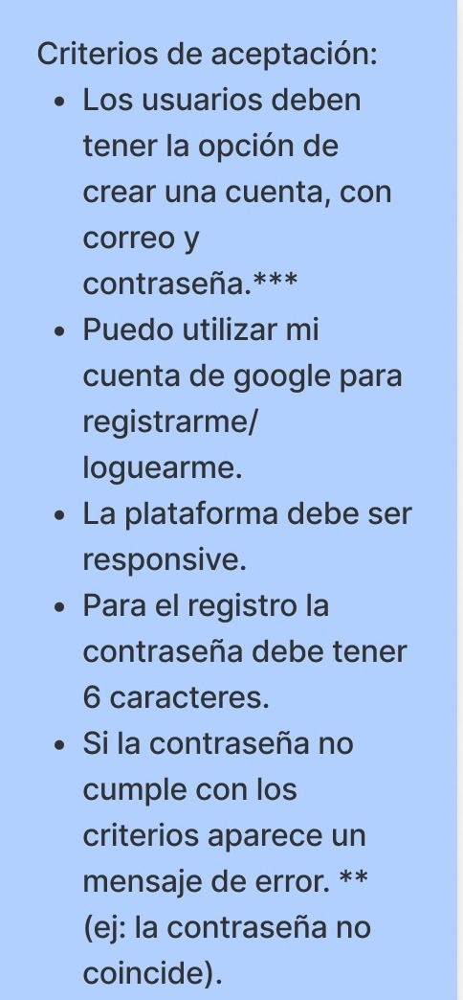
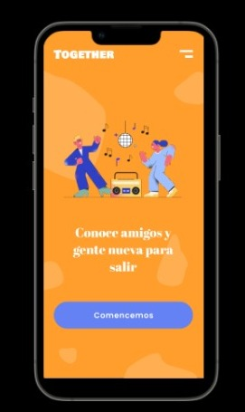
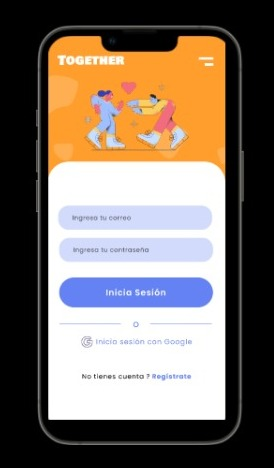
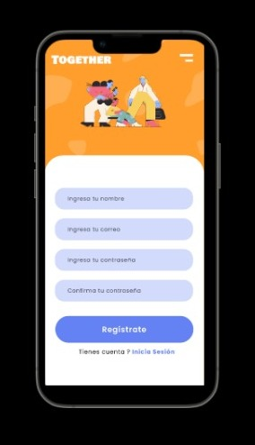

# Proyecto Red Social

## Índice

* [1. Presentación](#1-presentación)
* [2. Primeros pasos](#2-primeros-pasos)
* [3. Desarrollo del proyecto](#3-Desarrollo del proyecto)
* [4. Consideraciones generales](#4-consideraciones-generales)
* [5. Criterios de aceptación mínimos del proyecto](#5-criterios-de-aceptación-mínimos-del-proyecto)
* [6. Hacker edition](#6-hacker-edition)
* [7. Entrega](#7-entrega)
* [8. Pistas, tips y lecturas complementarias](#8-pistas-tips-y-lecturas-complementarias)

## 1. Presentación - Bienvenid@ a Together! -

¿Alguna vez te sentiste sol@? ¿Quisiste salir con alguien sencillamente a tomar un café o comentar la nueva serie de moda? Si tu respuesta es sí,
pues Together es para ti.
Actualmente la mayoría de apps sociales que existen para conocer gente nueva, están enfocadas principalmente en formar vínculos amorosos, citas 
románticas o encontrar a tu pareja ideal. 
Hasta ahora no existía ninguna dirigida únicamente a aquellos que simplemente quieren compañía sin la necesidad y la presión de gustarle a aquella nueva persona que conocen.
A partir de ésta necesidad que sentimos personalmente las desarrolladoras de la app, y la deficiencia de una app de este estilo en el mercado de 
redes sociales, nace Together. 

## 2. Primeros pasos

Para comenzar a darle forma y enfoque al proyecto, generamos una encuesta que compartimos con la mayor cantidad de personas que pudimos y tratando de abarcar las más diversas realidades y contextos. A continuación se presentan las preguntas y respuestas obtenidas del formulario.

.jpeg)
.jpeg)
.jpeg)
.jpeg)

A partir de lo expuesto anteriormente, definimos:

-¿Quiénes son los principales usuarios del producto?                    

Together está dirigido a todo público mayor de 18 años, la idea principal de la app es que personas de distintos rangos etarios compartan gustos
e intereses que los unan y permitan ampliar su círculo de amig@s, comenzando en la plataforma virtual y luego llevando el encuentro a la vida real.
Sin embargo y para ser más específicas, se proyecta que quienen usen la app sean personas entre 18 y 40 años.

-¿Qué problema resuelve el producto / para qué les servirá a estos usuarios?

Actualmente las redes sociales son parte de nuestra vida, se realizan millones de interacciones entre los usuarios cada día, pero, ¿Cuántas de esas interacciones vía web se convierten en una junta de amigos un viernes por la tarde?
Ese es el problema que intenta resolver Together, se aspira que sea una red social que una a los internautas en actividades cotidianas, divertidas y que les haga sentir acompañad@s.

## 2. Desarrollo del proyecto
 
 2.1 Primera historia de usuario

2.1.1 Prototipo baja fidelidad

2.1.2 Prototipo alta fidelidad

.jpeg)
.jpeg)

